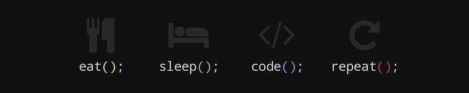

Welcome to my GitHub Profile. I'm an Italian guy🇮🇹 who started studying programming about 8 years ago, and currently, I am a computer engineering student at the University of Padua. I enjoy working mainly in web development and mobile applications.
  

    
    
    
        
      

    

<h2 class="heading-element" dir="auto">My favorite Languages and Technologies ⚙️</h2>

 

    

<h2 class="heading-element" dir="auto">Education📚</h2>
<ul dir="auto">
    <li>🏫<strong>University of Padua</strong>:
        <ul dir="auto">
            <li><strong>Completing Bachelor of Engineering Degree in Computer Engineering</strong>
                <ul dir="auto">
                    <li>2021  - (Present)</li>
                </ul>
            </li>
        </ul>
    </li>
    <li>🎒<strong>ITIS Volterra (VE)</strong>:
        <ul dir="auto">
            <li><strong>High School - IT</strong>
                <ul dir="auto">
                    <li>2016 – 2021</li>
                </ul>
            </li>
        </ul>
    </li>
</ul>

 

<h2 class="heading-element" dir="auto">GitHub Stats📊</h2>
 

    

 
<h2>Music Lover🎶</h2>

